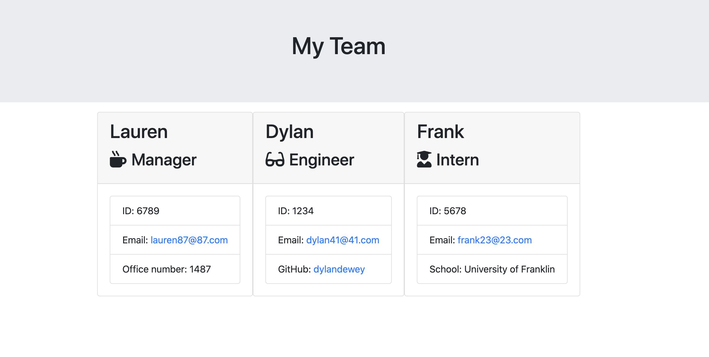

# employeesummary
This application is a command line app using node.js that will generate an organized html file of members of a software engineering team.  The file makes it easy for the user to find names, roles, emails, id's, and where applicable, school, GitHub username, or office number.  

These are the prompts presented to the user (one at a time):

Once completed, this is the html that is generated for the user:

